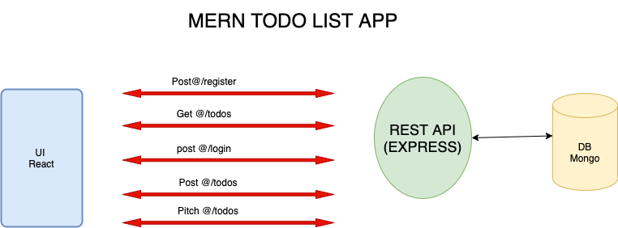

## Todo app planning : 

#### Week one :
### Frontend :
  - create login and register pages .
  - create the main page which include the add todo form with ADD CTA button and the todo item list.
  - the todo item list with edit CTA button and completed and incompleted tages .
  - drop down menu to filter the todo list based on completed and incompleted tages.
  - logout button
  ### Backend :
  -  DB and server connection 
  - User, Todo DB models 
  - Post routers for login, register, addToDoItem .
  - Get router for toDoGetAllItems. 
  - Pitch router for editToDo.

#### Week two :
- In this week I will be working on two or more features to add to the app and also enhance the UI styling
- Features : 
    - List Rearrangement. Reorder your Todo lists however you prefer!
    - Notes. Each task can have detailed notes.
    - More Tags. You can categorize your tasks by topic (English, Physics, Shopping, Church, etc.) then select single or multiple tags to show only related items. Click English & Physics to show just school items.
    

The diagram below shows the big picture of the app and how the app different parts communicate with each other . Also, it points out the technologies I am planning to use in each part .

